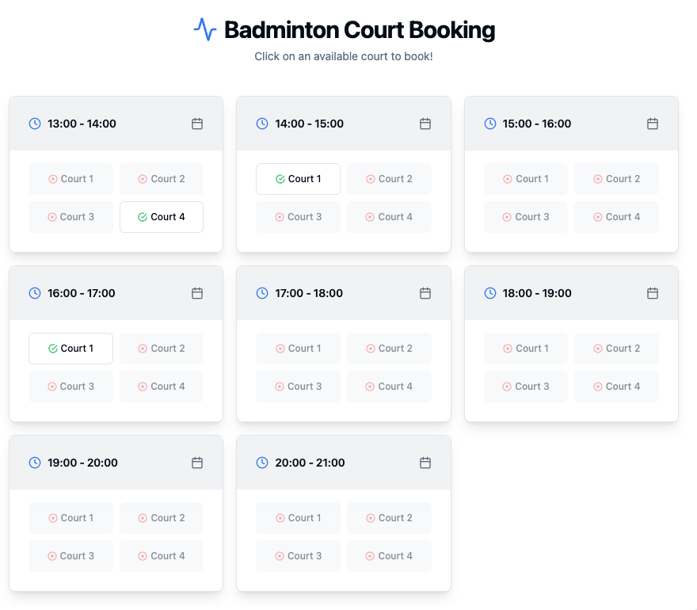
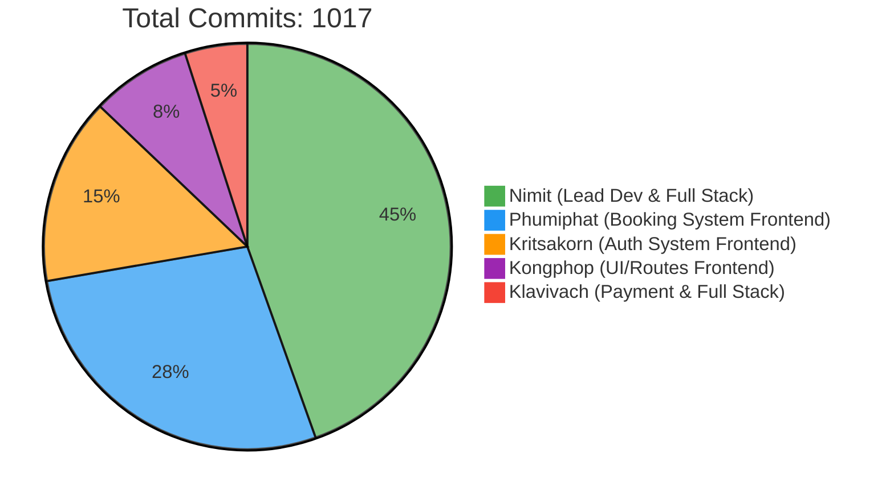
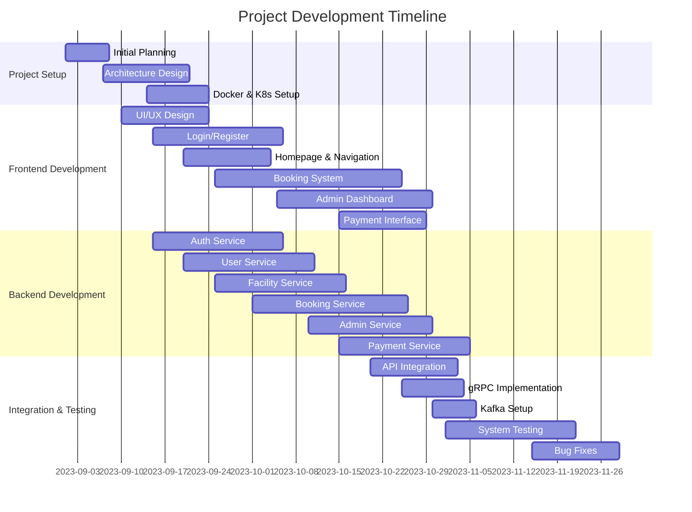

# Sport-Complex
This project is part of 1305308	Platform Development Course.
 
## Overview

This project aims to redesign the existing sport complex system to improve its scalability, performance, and user experience. The primary goals are to handle a larger number of users, enable easy scaling using a Kubernetes cluster, and leverage modern technologies like Golang, Echo, gRPC, and Kafka for efficient communication and interaction.

## Acknowledgements

- [Golang] (https://golang.org/)
- [Echo] (https://echo.labstack.com/)
- [gRPC] (https://grpc.io/)
- [Kafka] (https://kafka.apache.org/)
- [OOP] (https://www.w3schools.com/java/java_oop.asp)
- [Mono-Microservice Architecture] (https://microservices.io/patterns/microservices.html)
- [Kubernetes] (https://kubernetes.io/)
- [Docker] (https://www.docker.com/)
- [MongoDB] (https://www.mongodb.com/)
- [Git] (https://git-scm.com/)
- [GitHub] (https://github.com/)
- [JWT] (https://jwt.io/)
- [Next.js] (https://nextjs.org/)
- [Next UI] (https://nextui.org/)
- [Tailwind CSS] (https://tailwindcss.com/)
- [React] (https://reactjs.org/)

## Features

### Frontend
- **User Interface**
  - Responsive design for all devices
  - Dark/Light mode support
  - Accessible UI components
  - Real-time updates
  - Interactive booking calendar

### Backend Services

#### Authentication Service
- JWT-based authentication
- Role-based access control (RBAC)
- Session management
- Password encryption
- OAuth integration

#### Booking Service
- Real-time slot availability
- Concurrent booking handling
- Booking validation
- Cancellation management
- Slot locking mechanism

#### Facility Service
- Facility status tracking
- Maintenance scheduling
- Dynamic pricing
- Capacity management
- Resource allocation

#### Payment Service
- Secure payment processing
- Transaction history
- Refund handling
- Receipt generation
- Payment verification

#### Admin Service
- User management dashboard
- Booking oversight
- Facility management
- Analytics and reporting
- System configuration

#### Kafka Topics
```plaintext
booking.created
booking.updated
payment.processed
facility.status
notification.send
user.activity
```


### Figma Design
- [UI/UX Design](https://www.figma.com/file/xxxxx)
- [Component Library](https://www.figma.com/file/xxxxx)
- [Design System](https://www.figma.com/file/xxxxx)

### Functional Requirements

#### User Management
- User Registration and Authentication: Secure signup and login processes.
- Profile Management: View and update user details.
- Role-Based Access Control (RBAC): Define roles such as admin, staff, and customers with tailored permissions.
- Activity Tracking: Log user activities for security and system monitoring.

#### Booking System
- Facility Selection: Browse and select available sports facilities.
- Time Slot Booking: Reserve specific time slots for activities.
- Cancellation Handling: Allow users to cancel or reschedule bookings based on policies.
- Payment Integration: Seamless QR-code-based payment after booking.
- Booking History: Access and track past and upcoming reservations.
- Notifications: Receive booking confirmations and reminders.

#### Admin Panel
- User Management: Manage users, roles, and permissions.
- Facility Management: Create, update, and maintain facility slots and details.
- Booking Oversight: Monitor all bookings and handle conflicts or issues.
- Analytics and Reporting: Generate detailed usage and revenue reports.
- System Configuration: Customize system-wide settings and policies.

#### Payment Processing
- QR-Code Payments: Generate QR codes for secure payment after booking.
- Transaction History: Monitor and validate all payment transactions.
- Receipt Management: Issue digital receipts for completed payments.
- Secure Integration: Built with scalability and security in mind.

## Architecture

The architecture should include the following components:

- **User Service**: Handles user registration, login, profile management, and other user-related functions.
- **Booking Service**: Manages booking of facilities, timeslots, and payments.
- **Facility Service**: Manages information about available facilities and their pricing.
- **Notification Servic**: Sends notifications to users about bookings, cancellations, and other updates.
- **Payment Service**: Handles payment processing and integration with payment gateways.
- **Middleware**: Acts as a gateway for incoming requests, routing them to the appropriate services.
- **Kafka**: Used for asynchronous communication between services, especially for events like booking confirmations and payment updates.

## Setup

### Prerequisites

- Golang 1.23.0
- Docker
- Kubernetes (Minikube or a K8s cluster)
- Apache Kafka
- MongoDB

### Installation

1. **Clone the Repository:**

   ```bash
   git clone https://github.com/6531503042/Sport-Complex.git
   cd sport complex

<h2>📃 Start App in Terminal</h2>
Start

## Contributors

### Team Members and Contributions

<table>
<tr>
    <th>Student ID</th>
    <th>Name</th>
    <th>Contributions</th>
    <th>Statistics</th>
</tr>

<tr>
    <td>
        <a href="https://github.com/6531503042">6531503042</a>
    </td>
    <td>Nimit Tanboontor</td>
    <td>
        <b>Role:</b> Lead Developer<br/>
        <b>Responsibilities:</b>
        <ul>
            <li>Project Architecture & Foundation</li>
            <li>User Authentication Service</li>
            <li>Admin Dashboard Implementation
                <ul>
                    <li>User Management System</li>
                    <li>Facility Management Interface</li>
                    <li>Booking Enhancement</li>
                </ul>
            </li>
            <li>UI/UX Enhancement with Next.UI</li>
            <li>System Integration</li>
        </ul>
    </td>
    <td align="center">
        
        
        <br/>
        <b>45% of total contributions</b>
    </td>
</tr>

<tr>
    <td>
        <a href="https://github.com/2547phumiphat">6531503117</a>
    </td>
    <td>Phumiphat Wongsathit</td>
    <td>
        <b>Role:</b> Frontend Developer<br/>
        <b>Responsibilities:</b>
        <ul>
            <li>Booking System Implementation
                <ul>
                    <li>Badminton Court Booking</li>
                    <li>Football Field Reservation</li>
                    <li>Fitness Room Scheduling</li>
                    <li>Swimming Pool Booking</li>
                </ul>
            </li>
            <li>Slot Management System</li>
            <li>Real-time Slot Refresh</li>
        </ul>
    </td>
    <td align="center">
        
        
        <br/>
        <b>28% of total contributions</b>
    </td>
</tr>

<tr>
    <td>
        <a href="https://github.com/Kritsasoft">6531503005</a>
    </td>
    <td>Kritsakorn Sukkasem</td>
    <td>
        <b>Role:</b> Frontend Developer<br/>
        <b>Responsibilities:</b>
        <ul>
            <li>Authentication System
                <ul>
                    <li>Login Interface</li>
                    <li>Registration System</li>
                    <li>Role-Based Access Control</li>
                </ul>
            </li>
            <li>User Role Management</li>
            <li>Authentication Endpoints</li>
        </ul>
    </td>
    <td align="center">
        
        
        <br/>
        <b>15% of total contributions</b>
    </td>
</tr>

<tr>
    <td>
        <a href="https://github.com/kongphop1209">6531503008</a>
    </td>
    <td>Kongphop Saenphai</td>
    <td>
        <b>Role:</b> Frontend Developer<br/>
        <b>Responsibilities:</b>
        <ul>
            <li>Homepage Development</li>
            <li>Route Management</li>
            <li>Admin Sidebar Implementation</li>
            <li>Page Transitions & Effects</li>
        </ul>
    </td>
    <td align="center">
        
        
        <br/>
        <b>8% of total contributions</b>
    </td>
</tr>

<tr>
    <td>
        <a href="https://github.com/MABiuS1">6531503006</a>
    </td>
    <td>Klavivach Prajong</td>
    <td>
        <b>Role:</b> Backend Developer<br/>
        <b>Responsibilities:</b>
        <ul>
            <li>Payment System Integration</li>
            <li>Payment Page Development</li>
            <li>Payment Route Management</li>
        </ul>
    </td>
    <td align="center">
        
        
        <br/>
        <b>4% of total contributions</b>
    </td>
</tr>

</table>

### Contribution Distribution


### Weekly Contribution Timeline


### Repository Statistics
- **Total Commits:** 1,010
- **Active Pull Requests:** 35
- **Completed Features:** 12
- **Active Contributors:** 5
- **Lines of Code:** 15,000+

View detailed contribution statistics: [Contributors Graph](https://github.com/6531503042/Sport-Complex/graphs/contributors)

Last updated: 2024-11-28 13:58:09 UTC
